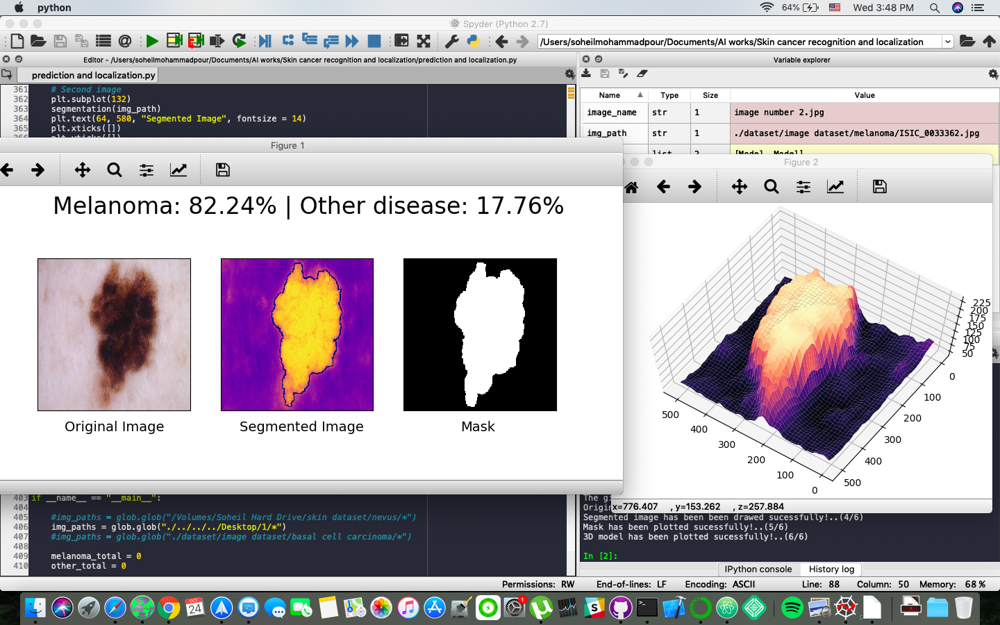

# Skin Cancer Classifier

An AI-powered image classifier for skin lesions could revolutionize dermatological diagnoses in healthcare organizations. By accurately identifying various types of skin lesions, this tool would address the challenge of misdiagnosis due to similar appearances, provide reliable second opinions, and enhance confidence in treatment plans. It would streamline the diagnostic process, saving time for dermatologists and allowing them to focus more on patient care. The system's easy integration with existing healthcare technology would make it accessible and practical for medical professionals, ultimately improving work efficiency and patient outcomes in dermatology departments.

Demo of the app:

