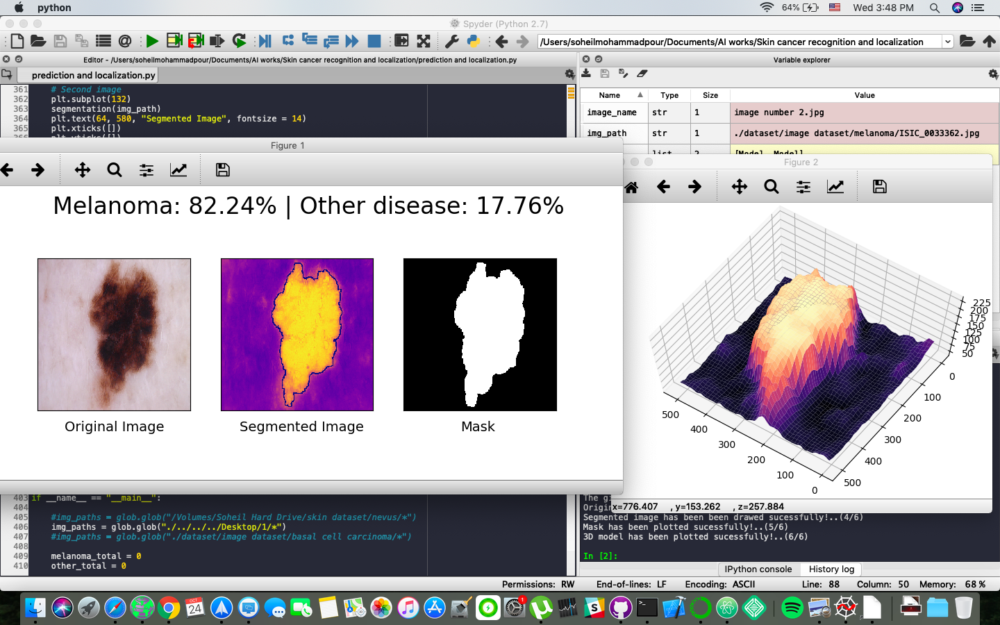

# Skin cancer recoginition for detecting melanoma

Here we will design an algorithm that can visually diagnose melanoma, the deadliest form of skin cancer. In particular, the algorithm will distinguish this malignant skin tumor from other types of benign lesions.

The data and objective are pulled from the ISIC Challenge on Skin Lesion Analysis Towards Melanoma Detection. As part of the challenge, participants were tasked to design an algorithm to diagnose skin lesion images as one of three different skin diseases (melanoma, nevus, or seborrheic keratosis).

